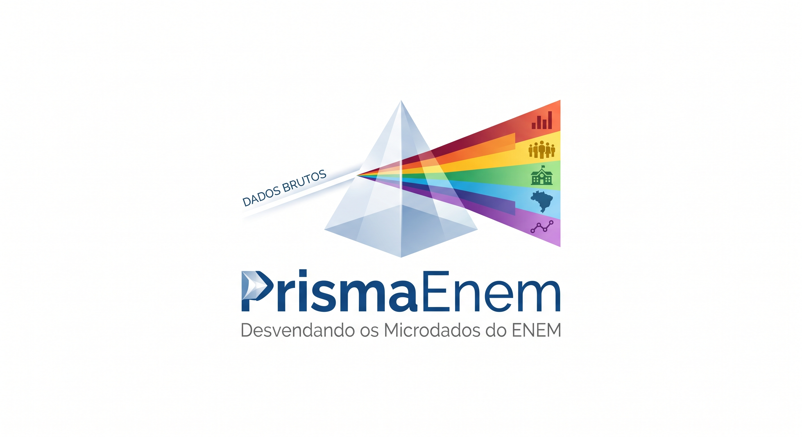

# PrismaEnem: Desvendando os Microdados do ENEM

 <!-- Placeholder para uma logo criativa -->

## ✨ Visão Geral

O **PrismaEnem** é um boilerplate robusto e modular, projetado para transformar a complexidade dos microdados do Exame Nacional do Ensino Médio (ENEM) em um espectro de insights claros e acionáveis. Assim como um prisma decompõe a luz branca em suas cores constituintes, este projeto permite que desenvolvedores, cientistas de dados e pesquisadores desvendem o vasto universo de informações educacionais do Brasil, democratizando o acesso e a análise de dados.

PrismaEnem oferece uma base sólida para construir aplicações que capturam, processam e analisam o desempenho educacional em larga escala. Seja para criar rankings de escolas, acompanhar tendências históricas ou aprofundar-se em análises socioeconômicas, o PrismaEnem é a sua ferramenta essencial.

## 🚀 Por Que Usar o PrismaEnem?

- **Acelere seu Projeto:** Inicie sua jornada de análise de dados do ENEM com uma infraestrutura pré-configurada e otimizada.
- **Modularidade e Reuso:** Componentes bem definidos e desacoplados facilitam a adaptação e integração em diversos contextos.
- **Escalabilidade:** Arquitetura pensada para lidar com o crescente volume de dados do ENEM, desde análises locais até ambientes distribuídos em nuvem.
- **Comunidade Open Source:** Contribua, aprenda e colabore com uma comunidade engajada na melhoria da educação através dos dados.
- **Insights Acionáveis:** Transforme dados brutos em informações estratégicas para gestores, educadores e pesquisadores.

## 💡 Funcionalidades Principais

O PrismaEnem oferece uma estrutura completa para:

- **Ingestão Automatizada:** Scripts para download e extração eficiente dos arquivos ZIP dos microdados do INEP.
- **Processamento ETL Robusto:** Pipelines de Extração, Transformação e Carga (ETL) para limpeza, padronização, enriquecimento e agregação de dados.
- **Armazenamento Estruturado:** Organização de dados brutos em um Data Lake e dados processados em um Data Warehouse otimizado para consultas.
- **API Exemplo:** Um esqueleto de API RESTful para expor dados agregados e facilitar a integração com outras aplicações.
- **Frontend Básico:** Uma aplicação web de exemplo para visualização inicial de dados e demonstração de capacidades.

## 🏗️ Arquitetura

A arquitetura do PrismaEnem adota um modelo de Data Lakehouse, combinando a flexibilidade do armazenamento de dados brutos com a estrutura e performance de um Data Warehouse. Os principais componentes e o fluxo de dados são ilustrados abaixo:


### Componentes Chave:

- **Fonte de Dados:** Instituto Nacional de Estudos e Pesquisas Educacionais Anísio Teixeira (INEP) - Microdados ENEM.
- **Armazenamento Bruto (Data Lake):** Soluções de Cloud Storage (AWS S3, Google Cloud Storage) para arquivos ZIP e CSVs originais.
- **Serviço de Ingestão:** Scripts Python orquestrados para automação do download e extração.
- **Processamento de Dados:** Ferramentas como DuckDB/Polars (para ambientes single-node) ou Dask/Apache Spark (para processamento distribuído).
- **Data Warehouse:** Google BigQuery (ou soluções similares como Snowflake, Amazon Redshift) para dados tratados e agregados.
- **Motor de Análise:** DuckDB ou ClickHouse para consultas de baixa latência e dashboards interativos.
- **Serviço de API:** Frameworks Python (FastAPI/Flask) ou Node.js (Express) para exposição de dados via API.
- **Aplicação Frontend:** React (ou Vue.js, Angular) com bibliotecas de visualização (Chart.js, Mapbox GL JS) para interface do usuário.

## 🛠️ Stack Tecnológico Recomendado

| Camada / Componente         | Tecnologia Principal           | Alternativas / Complementos        |
| :-------------------------- | :----------------------------- | :--------------------------------- |
| **Ingestão**                | Python (`requests`, `zipfile`) | Airflow, Prefect, Dagster          |
| **Armazenamento Bruto**     | AWS S3                         | Google Cloud Storage, Azure Blob   |
| **Processamento (ETL)**     | DuckDB / Polars                | Dask, Apache Spark, Pandas (menor) |
| **Data Warehouse**          | Google BigQuery                | Snowflake, Amazon Redshift         |
| **Motor de Análise**        | DuckDB                         | ClickHouse, Apache Druid           |
| **API**                     | Python (FastAPI)               | Node.js (Express), Go (Gin)        |
| **Frontend**                | React + Tailwind CSS           | Vue.js, Angular                    |
| **Visualização (Frontend)** | Chart.js, Mapbox GL JS         | D3.js, Recharts, Leaflet           |
| **Orquestração**            | Docker Compose                 | Kubernetes, AWS ECS, GCP GKE       |

## 🚀 Como Começar

### Pré-requisitos

Certifique-se de ter instalado em sua máquina:

- [Python 3.8+](https://www.python.org/downloads/)
- [Node.js](https://nodejs.org/en/download/) (para o desenvolvimento do frontend)
- [Docker e Docker Compose](https://docs.docker.com/get-docker/) (altamente recomendado para um ambiente de desenvolvimento consistente)

### Instalação

1.  **Clone o repositório:**

    ```bash
    git clone https://github.com/yurialvesferreira/PrismaEnem.git
    cd PrismaEnem
    ```

2.  **Configuração do Ambiente Python:**

    ```bash
    python -m venv venv
    source venv/bin/activate # No Windows: .\venv\Scripts\activate
    pip install -r requirements.txt
    ```

3.  **Configuração do Ambiente Frontend (Opcional):**
    Se você planeja trabalhar com o frontend, navegue até o diretório e instale as dependências:

    ```bash
    cd src/frontend
    npm install # ou yarn install
    cd ../..
    ```

4.  **Variáveis de Ambiente:**
    Crie um arquivo `.env` na raiz do projeto, baseado no `.env.example`, e preencha com suas credenciais e configurações. Exemplo:

    ```ini
    # INEP Data Source
    INEP_DATA_URL_BASE=https://download.inep.gov.br/microdados/

    # AWS S3 (se aplicável)
    AWS_ACCESS_KEY_ID=SEU_ACCESS_KEY
    AWS_SECRET_ACCESS_KEY=SEU_SECRET_KEY
    AWS_REGION=us-east-1

    # Google BigQuery (se aplicável)
    BIGQUERY_PROJECT_ID=SEU_PROJETO_BIGQUERY
    ```

### Uso Básico

#### 1. Ingestão de Dados

Para baixar e extrair os microdados de um ano específico (ex: 2023):

```bash
python src/ingestion/download_data.py --year 2023
```

#### 2. Processamento de Dados

Após a ingestão, processe os dados brutos para gerar os dados tratados e agregados:

```bash
python src/processing/process_data.py --year 2023
```

#### 3. Executando a API (Exemplo)

Inicie o servidor da API (no diretório `src/api`):

```bash
cd src/api
uvicorn main:app --reload
```

#### 4. Executando o Frontend (Exemplo)

Inicie a aplicação frontend (no diretório `src/frontend`):

```bash
cd src/frontend
npm start # ou yarn start
```

## 📂 Estrutura do Projeto

```
PrismaEnem/
├── data/
│   ├── raw/             # Microdados ZIPs e CSVs brutos do INEP
│   └── processed/       # Dados processados, limpos e agregados (e.g., Parquet)
├── src/
│   ├── ingestion/       # Módulo de Ingestão: Scripts para download e extração
│   │   └── download_data.py
│   ├── processing/      # Módulo de Processamento: Scripts para ETL e transformação
│   │   └── process_data.py
│   ├── api/             # Módulo de API: Código da API (FastAPI/Flask)
│   │   └── main.py
│   └── frontend/        # Módulo Frontend: Código da aplicação web (React)
│       └── App.js
├── config/              # Arquivos de configuração do projeto
│   └── settings.py
├── docs/                # Documentação adicional, diagramas de arquitetura
│   └── boilerplate_architecture.png
├── .env.example         # Exemplo de variáveis de ambiente
├── requirements.txt     # Dependências Python
├── Dockerfile           # Dockerfile para conteinerização da aplicação
└── README.md            # Este arquivo
```

## 🤝 Contribuição

Contribuições são o coração de projetos open-source! Se você tem ideias, melhorias ou encontrou um bug, sinta-se à vontade para contribuir. Siga os passos:

1.  Faça um fork do repositório.
2.  Crie uma nova branch para sua feature (`git checkout -b feature/minha-nova-feature`).
3.  Implemente suas mudanças e adicione testes relevantes.
4.  Garanta que todos os testes passem e que o código siga as diretrizes de estilo.
5.  Faça commit das suas mudanças (`git commit -m 'feat: Adiciona funcionalidade X para Y'`).
6.  Envie para a sua branch (`git push origin feature/minha-nova-feature`).
7.  Abra um Pull Request detalhando suas alterações e o problema que ele resolve.

## 🔗 Referências

- **Microdados ENEM - Portal Gov.br:**
  [https://www.gov.br/inep/pt-br/acesso-a-informacao/dados-abertos/microdados/enem](https://www.gov.br/inep/pt-br/acesso-a-informacao/dados-abertos/microdados/enem)

## 📄 Licença

Este projeto está licenciado sob a [MIT License](LICENSE).
